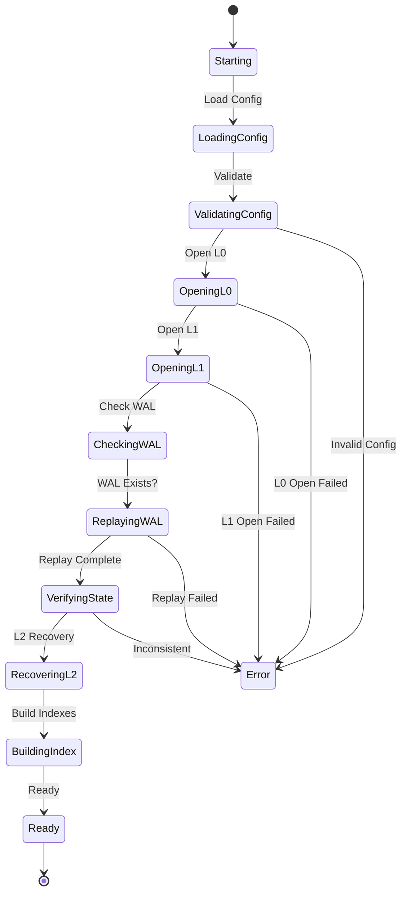

# TieredCache - Multi-Tier Data Tiering System

## Project Overview

**Project Name:** TieredCache  
**Type:** High-Performance Distributed Cache System  
**Core Functionality:** Multi-tier data tiering system with L0 (in-memory), L1 (SSD), and L2 (cold storage) layers, featuring automatic tiering, background sink to multiple backends, and full replay/recovery capabilities.  
**Target Users:** High-throughput applications requiring tiered caching with durability guarantees  
**Implementation:** Go (with optional Rust components for performance-critical paths)

---

## Architecture Overview

### Tier Structure

```
┌─────────────────────────────────────────────────────────────────────┐
│                        TIERED CACHE SYSTEM                         │
├─────────────────────────────────────────────────────────────────────┤
│                                                                     │
│  ┌──────────────┐    ┌──────────────┐    ┌──────────────────────┐  │
│  │   L0 Otter   │ →  │ L1 Badger    │ →  │     L2 Cold Tier     │  │
│  │  (In-Memory) │    │  (32-Sharded │    │                      │  │
│  │              │    │   SSD)       │    │  ┌────┐ ┌────┐ ┌───┐ │  │
│  │  Max 32KB    │    │              │    │  │Kafk│ │Mini│ │PG │ │  │
│  │  Payloads    │    │  10 TB Max  │    │  │a   │ │o   │ │   │ │  │
│  │              │    │              │    │  └──┘ └──┘ └───┘ │   │  │
│  │  Lock-Free   │    │  Weighted    │    │     + Future    │   │  │
│  │  Writes      │    │  4KB Units  │    │     Backends     │   │  │
│  └──────────────┘    └──────────────┘    └──────────────────────┘  │
│                                                                     │
│  ┌──────────────────────────────────────────────────────────────┐  │
│  │              BACKGROUND SINKS (Parallel)                     │  │
│  │  ┌─────────┐  ┌─────────┐  ┌─────────┐  ┌───────────────┐  │  │
│  │  │  Kafka  │  │  MinIO  │  │ Postgres│  │ FutureBackend │  │  │
│  │  │  Sink   │  │   Sink  │  │   Sink  │  │    (Plugin)   │  │  │
│  │  └─────────┘  └─────────┘  └─────────┘  └───────────────┘  │  │
│  └──────────────────────────────────────────────────────────────┘  │
│                                                                     │
│  ┌──────────────────────────────────────────────────────────────┐  │
│  │              REPLAY / RECOVERY SYSTEM                        │  │
│  │  ┌─────────────┐  ┌─────────────┐  ┌─────────────────────┐   │  │
│  │  │  WAL Log    │→ │  Recovery   │→ │  State Verification │   │  │
│  │  │  (Write     │  │   Manager   │  │    & Consistency    │   │  │
│  │  │  Ahead)     │  │             │  │                     │   │  │
│  │  └─────────────┘  └─────────────┘  └─────────────────────┘   │  │
│  └──────────────────────────────────────────────────────────────┘  │
└─────────────────────────────────────────────────────────────────────┘
```

### Data Flow

```mermaid
flowchart TB
    subgraph Write["Write Path"]
        W1[Write Request] --> W2{L0 Has Space?}
        W2 -->|Yes| W3[Write to L0]
        W2 -->|No| W4{Evict to L1?}
        W4 -->|Yes| W5[Evict to L1]
        W4 -->|No| W6[Reject/Error]
        W3 --> W7[Write WAL]
        W5 --> W7
    end

    subgraph Read["Read Path"]
        R1[Read Request] --> R2{L0 Hit?}
        R2 -->|Yes| R3[Return from L0]
        R2 -->|No| R4{L1 Hit?}
        R4 -->|Yes| R5[Promote to L0]
        R4 -->|No| R6{L2 Hit?}
        R6 -->|Yes| R7[Promote to L1]
        R6 -->|No| R8[Return Not Found]
    end

    subgraph Tiering["Background Tiering"]
        T1[Tiering Worker] --> T2{Check L0 Memory}
        T2 -->|Above Threshold| T3[Select Eviction Candidates]
        T3 --> T4[Write to L1 Badger]
        T4 --> T5{Write Success?}
        T5 -->|Yes| T6[Remove from L0]
        T5 -->|No| T7[Mark Bad/Retry]
    end

    subgraph Sink["Background Sink"]
        S1[Sink Worker] --> S2[Read from L1]
        S2 --> S3{Configure Backends?}
        S3 -->|Kafka| S4[Send to Kafka]
        S3 -->|MinIO| S5[Store in MinIO]
        S3 -->|Postgres| S6[Store in Postgres]
        S4 --> S7{Multi-backend?}
        S5 --> S7
        S6 --> S7
    end
```



---

## Module Structure

```
tieredcache/
├── cmd/
│   └── tieredcache/
│       └── main.go                 # Application entry point
├── pkg/
│   ├── config/
│   │   ├── config.go               # Configuration structure
│   │   ├── validator.go           # Config validation
│   │   └── defaults.go             # Default values
│   ├── l0/
│   │   ├── l0_cache.go             # L0 Otter-style cache
│   │   ├── shard.go                # Sharded L0 storage
│   │   ├── eviction.go             # LRU/LFU eviction
│   │   └── stats.go                # L0 statistics
│   ├── l1/
│   │   ├── l1_badger.go            # L1 Badger wrapper
│   │   ├── shard_manager.go        # 32-shard management
│   │   ├── wal.go                  # Write-Ahead Log
│   │   └── migration.go            # L0→L1 migration
│   ├── l2/
│   │   ├── sink.go                  # Sink interface
│   │   ├── kafka_sink.go           # Kafka backend
│   │   ├── minio_sink.go           # MinIO backend
│   │   ├── postgres_sink.go        # Postgres backend
│   │   └── future_backend.go       # Plugin interface
│   ├── replay/
│   │   ├── recovery.go             # Recovery manager
│   │   ├── wal_replayer.go         # WAL replay
│   │   ├── state_manager.go        # State consistency
│   │   └── verification.go         # Data verification
│   ├── tiering/
│   │   ├── manager.go              # Tiering orchestrator
│   │   ├── policy.go               # Tiering policies
│   │   └── worker.go               # Background workers
│   ├── common/
│   │   ├── errors.go               # Error definitions
│   │   ├── types.go                # Common types
│   │   └── utils.go                # Utilities
│   └── cache/
│       ├── cache.go                # Main cache interface
│       └── cache_impl.go           # Cache implementation
├── configs/
│   └── config.yaml                 # Example configuration
├── tests/
│   ├── integration/
│   └── unit/
└── docs/
    └── api.md
```

---

## Detailed Specifications

### 1. L0 Cache (Otter-Style In-Memory)

**Purpose:** High-speed in-memory cache with excellent hit rates

**Specifications:**
- **Max Payload Size:** 32 KB per entry
- **Weighted Units:** 4 KB weighted payloads (8 × 4KB = 32KB max)
- **Sharding:** 64 shards for lock-free concurrent access
- **Eviction:** LRU with frequency tracking (Otter-style adaptive)
- **Memory Budget:** Configurable (default 8GB)
- **Consistency:** eventual consistency within tier

**Key Features:**
- Clock-Pro algorithm for efficient LRU
- Frequency sketch for access tracking
- Lock-free reads, minimal-lock writes
- Automatic promotion of hot keys
- Write-through to WAL

### 2. L1 Cache (Badger SSD)

**Purpose:** High-capacity SSD-based storage

**Specifications:**
- **Sharding:** 32 shards (key-based distribution)
- **Max Capacity:** 10 TB
- **Storage Path:** Configurable SSD mount point
- **Value Log:** Separate from key storage
- **Compression:** ZSTD for value compression
- **Sync Mode:** Periodic fsync (configurable)

**Key Features:**
- Memory-mapped access for hot data
- Write-ahead log for durability
- LRU eviction at shard level
- Weighted eviction based on 4KB units
- Automatic tier-up from L0

### 3. L2 Background Sink

**Purpose:** Parallel cold storage with multiple backend support

**Supported Backends:**

| Backend | Purpose | Protocol |
|---------|---------|----------|
| Kafka | Event streaming, replay | Kafka Producer API |
| MinIO | Object storage, archives | S3-compatible API |
| Postgres | Structured storage | PostgreSQL wire protocol |
| Future | Extensibility | Plugin interface |

**Sink Features:**
- Parallel processing of all backends
- Configurable batch sizes
- Retry with exponential backoff
- Dead-letter queue for failed items
- Exactly-once semantics (where supported)

### 4. Replay/Recovery System

**Purpose:** Ensure data consistency after application restart



**Recovery Steps:**
1. Load and validate configuration
2. Open L0 (in-memory) - restore from disk snapshot
3. Open L1 (Badger) - verify database integrity
4. Read WAL - identify uncommitted entries
5. Replay WAL entries in order
6. Verify state consistency
7. Recover L2 metadata
8. Build search indexes
9. Mark system ready

**WAL (Write-Ahead Log) Specifications:**
- Location: Separate SSD volume
- Format: Binary with checksums
- Rotation: Size-based (256MB default)
- Retention: Until replay confirmed

---

## Configuration Specification

```yaml
tieredcache:
  # L0 In-Memory Cache (Otter-style)
  l0:
    max_memory_mb: 8192          # 8GB default
    max_payload_bytes: 32768     # 32KB max
    weighted_unit_bytes: 4096   # 4KB weighted
    shard_count: 64              # Lock-free shards
    eviction_policy: clock_pro   # or lru, lfu
    snapshot_interval_sec: 300   # Disk snapshot interval
  
  # L1 Badger SSD Cache
  l1:
    max_capacity_tb: 10          # 10TB max
    shard_count: 32              # 32 shards
    ssd_path: /mnt/nvme0         # SSD mount point
    value_log_path: /mnt/nvme1   # Separate volume recommended
    sync_mode: periodic          # or immediate, disabled
    sync_interval_ms: 1000      # Periodic sync interval
    compression: zstd            # zstd, snappy, none
    wal_enabled: true            # Enable WAL
  
  # L2 Cold Tier Sinks
  l2:
    enabled: true
    sinks:
      kafka:
        enabled: true
        brokers:
          - kafka1:9092
          - kafka2:9092
        topic: tieredcache-cold
        batch_size: 100
        flush_interval_ms: 1000
      
      minio:
        enabled: true
        endpoint: localhost:9000
        bucket: tieredcache
        access_key: minioadmin
        secret_key: minioadmin
        use_ssl: false
      
      postgres:
        enabled: true
        host: localhost
        port: 5432
        database: tieredcache
        username: postgres
        password: ""
        table: cold_data
    
    # Tiering policies
    tiering:
      l0_to_l1_threshold: 0.85   # 85% memory usage
      l1_to_l2_threshold: 0.90    # 90% disk usage
      tier_interval_sec: 60       # Check every 60s
      batch_size: 1000            # Items per batch
  
  # Replay/Recovery
  replay:
    wal_path: /mnt/nvme2/wal
    max_replay_workers: 4
    verify_on_recovery: true
    checkpoint_interval: 10000    # Checkpoint every 10k ops
  
  # Logging
  logging:
    level: info                   # debug, info, warn, error
    format: json                 # json, text
    output: stdout               # stdout, file
```

---

## Error Handling Strategy

### Error Categories

| Category | Description | Handling |
|----------|-------------|----------|
| ConfigError | Invalid configuration | Fail fast with detailed message |
| InitError | Initialization failure | Retry with backoff, then fail |
| StorageError | L0/L1 storage failure | Automatic failover, notify |
| SinkError | L2 sink failure | Retry queue, dead-letter |
| RecoveryError | Replay failure | Detailed logging, manual intervention |
| ConsistencyError | Data inconsistency | Quarantine, alert |

### Error Response Types

```go
// ConfigError - Configuration validation errors
type ConfigError struct {
    Field   string
    Value   interface{}
    Reason  string
    Suggest string // Suggestion for fix
}

// InitError - Initialization errors with context
type InitError struct {
    Component string
    Operation string
    Err       error
    Retryable bool
}

// StorageError - Storage layer errors
type StorageError struct {
    Tier     string  // "l0", "l1", "l2"
    Key      string
    Err      error
    Retryable bool
}

// RecoveryError - Recovery process errors  
type RecoveryError struct {
    Phase    string  // "load", "replay", "verify"
    Position int64   // WAL position
    Err      error
}
```

### Error Coverage Requirements

- **Configuration:** 100% validation coverage
- **Initialization:** All init paths have error handlers
- **Operations:** Every operation has error return
- **Recovery:** All failure modes handled
- **Logging:** All errors logged with context

---

## Consistency Guarantees

### Consistency Levels

1. **L0 (In-Memory)**
   - Eventual consistency for reads
   - Strong consistency for writes (via WAL)
   - Lock-free for read-heavy workloads

2. **L1 (Badger SSD)**
   - Configurable: immediate, periodic, disabled sync
   - WAL ensures durability
   - MVCC for concurrent access

3. **L2 (Cold Storage)**
   - Eventual consistency
   - Best-effort ordering
   - Dead-letter for failed writes

### Lock-Free Design

- **Reads:** Completely lock-free via sharding
- **Writes:** Minimal locking (single mutex per shard)
- **Tiering:** Async background workers
- **Sink:** Independent goroutines per backend

---

## Performance Targets

| Metric | Target |
|--------|--------|
| L0 Read Latency | < 100μs (p99) |
| L1 Read Latency | < 1ms (p99) |
| L2 Read Latency | < 100ms (p99) |
| Write Throughput | 100K ops/sec |
| Tiering Throughput | 50K ops/sec |
| Sink Throughput | 10K ops/sec (per backend) |

---

## API Design

### Main Cache Interface

```go
type Cache interface {
    // Basic operations
    Get(ctx context.Context, key string) ([]byte, error)
    Set(ctx context.Context, key string, value []byte, ttl time.Duration) error
    Delete(ctx context.Context, key string) error
    
    // Tier-specific
    GetFromTier(ctx context.Context, key string, tier Tier) ([]byte, error)
    Promote(ctx context.Context, key string, toTier Tier) error
    
    // Admin
    Stats() (Stats, error)
    Close() error
}

type Tier int
const (
    TierL0 Tier = iota
    TierL1
    TierL2
)
```

---

## Implementation Phases

### Phase 1: Core Infrastructure
- Configuration management
- Error types and handling
- Basic interfaces

### Phase 2: L0 Cache
- Sharded in-memory storage
- Clock-Pro eviction
- Snapshot/restore

### Phase 3: L1 Cache  
- Badger integration
- 32-shard management
- WAL implementation

### Phase 4: Tiering
- L0→L1 migration
- Background workers
- Policy engine

### Phase 5: L2 Sinks
- Kafka sink
- MinIO sink
- Postgres sink

### Phase 6: Recovery
- WAL replay
- State verification
- Checkpoint management

### Phase 7: Integration
- End-to-end tests
- Performance benchmarks
- Documentation
