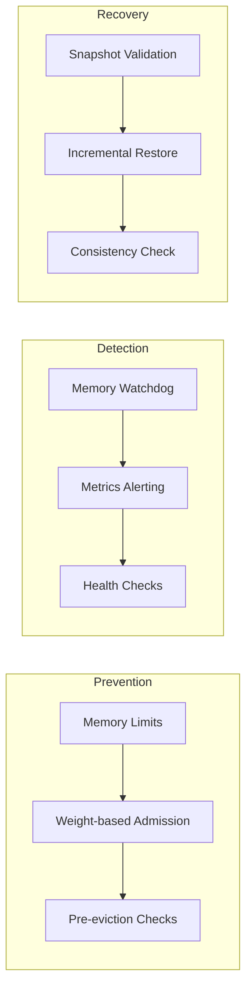

# TieredCache Architecture: Failure & Corruption Analysis

## Executive Summary

This document provides a comprehensive analysis of potential failure modes and data corruption sources in the TieredCache system, along with planned remedies and mitigations.

---

## Architecture Overview

```
┌─────────────────────────────────────────────────────────────────────────────┐
│                         TIERED CACHE SYSTEM                                 │
├─────────────────────────────────────────────────────────────────────────────┤
│                                                                              │
│  ┌──────────────┐    ┌──────────────┐    ┌──────────────────────────────┐ │
│  │   L0 Otter   │ →  │ L1 Badger    │ →  │     L2 Cold Tier             │ │
│  │  (In-Memory) │    │  (SSD)       │    │                              │ │
│  └──────────────┘    └──────────────┘    └──────────────────────────────┘ │
│         │                   │                         │                      │
│         ▼                   ▼                         ▼                      │
│  ┌──────────────┐    ┌──────────────┐          ┌──────────────┐           │
│  │   Snapshot   │    │      WAL      │          │     Sink     │           │
│  │   (Periodic) │    │  (Recovery)  │          │   Manager    │           │
│  └──────────────┘    └──────────────┘          └──────────────┘           │
│                                                                              │
└─────────────────────────────────────────────────────────────────────────────┘
```

---

## Failure Categories

### 1. L0 In-Memory Cache Failures

| ID | Failure Mode | Severity | Likelihood | Impact |
|----|--------------|----------|------------|--------|
| L0-01 | Memory exhaustion leading to OOM crash | Critical | Medium | Complete service failure |
| L0-02 | Clock-Pro eviction race condition | High | Low | Data loss, inconsistent state |
| L0-03 | Snapshot corruption during write | High | Medium | Lost data, recovery failure |
| L0-04 | Shard hotspot due to key skew | Medium | Medium | Performance degradation |
| L0-05 | Concurrent access causing data race | High | Low | Corrupted reads/writes |
| L0-06 | TTL not properly enforced | Medium | Low | Stale data served |

#### Remedies for L0 Failures



**Implementation Plan:**

1. **L0-01 (Memory Exhaustion)**
   - Add memory pressure monitoring with configurable thresholds
   - Implement aggressive eviction when memory reaches 90% limit
   - Add circuit breaker to reject new writes at 95% threshold
   - Set JVM-style memory limits with cgroup enforcement

2. **L0-02 (Clock-Pro Race)**
   - Add mutex protection around clock hand advancement
   - Implement double-check locking for eviction candidates
   - Add unit tests for concurrent eviction scenarios

3. **L0-03 (Snapshot Corruption)**
   - Implement atomic file writes (write-to-temp + rename)
   - Add CRC32 checksum to snapshot files
   - Maintain snapshot version header for format validation
   - Keep rolling snapshots (last 3 versions)

4. **L0-04 (Shard Hotspot)**
   - Implement consistent hashing with virtual nodes
   - Add per-shard memory usage monitoring
   - Rebalance shards when imbalance exceeds 20%

---

### 2. L1 Badger SSD Cache Failures

| ID | Failure Mode | Severity | Likelihood | Impact |
|----|--------------|----------|------------|--------|
| L1-01 | Disk full causing write failures | Critical | Medium | Tiering failure, backpressure |
| L1-02 | Unexpected shutdown causing data loss | High | Medium | Lost recent writes |
| L1-03 | Value log corruption | Critical | Low | Unrecoverable data loss |
| L1-04 | Shard corruption isolated to one shard | High | Low | Partial data loss |
| L1-05 | Sync failure in periodic mode | Medium | Medium | Lost writes on crash |
| L1-06 | Compression algorithm bug | Medium | Low | Corrupted reads |

#### Remedies for L1 Failures

**Implementation Plan:**

1. **L1-01 (Disk Full)**
   - Implement disk space monitoring with alerts at 80%, 90%
   - Add automatic tiering trigger when disk exceeds 85% usage
   - Configure L1 to use "immediate" sync mode when near capacity
   - Add emergency eviction of oldest entries

2. **L1-02 (Unexpected Shutdown)**
   - Force "immediate" sync mode for production deployments
   - Implement dual WAL: one in L1 + one in tieredcache
   - Add write-ahead logging at application level

3. **L1-03 (Value Log Corruption)**
   - Implement value log truncation/repair on startup
   - Add GC (garbage collection) for value logs
   - Keep value log on separate SSD from key store

4. **L1-05 (Sync Failure)**
   - Add error callback for sync failures
   - Implement retry queue for failed syncs
   - Log sync errors with sequence numbers for recovery

---

### 3. WAL/Recovery System Failures

| ID | Failure Mode | Severity | Likelihood | Impact |
|----|--------------|----------|------------|--------|
| WAL-01 | WAL file corruption | Critical | Low | Incomplete recovery |
| WAL-02 | Checkpoint file corruption | High | Low | Excessive replay time |
| WAL-03 | Partial WAL entry causing parse failure | High | Low | Recovery halts |
| WAL-04 | Checkpoint race condition | Medium | Low | Lost checkpoints |
| WAL-05 | Sequence number overflow | Low | Very Low | Long-running systems |
| WAL-06 | WAL disk full | Critical | Low | Write failures |

#### Remedies for WAL Failures

**Current Code Issue in `recovery.go:334`:**
```go
// Current: Checksum verification happens AFTER reading entry
if !verifyChecksum(entry) {
    return entries, fmt.Errorf("checksum mismatch at sequence %d", entry.Sequence)
}
```

**Recommended Fix:**
```go
// Read size with validation
// If size exceeds MAX_ENTRY_SIZE, treat as corruption and skip
// If checksum fails, skip corrupted entry and continue (not halt)
// Track skipped entries in recovery result for alerting
```

**Implementation Plan:**

1. **WAL-01 (WAL Corruption)**
   - Implement WAL log rotation (256MB files)
   - Add magic header to WAL files for validation
   - Implement WAL repair tool that can:
     - Skip corrupted entries
     - Truncate to last valid entry
     - Rebuild index from WAL

2. **WAL-02 (Checkpoint Corruption)**
   - Add checksum to checkpoint files (JSON + CRC32)
   - Maintain checkpoint metadata file with latest valid checkpoint
   - Implement checkpoint validation on load

3. **WAL-03 (Partial Entry)**
   - Add max entry size limit (1MB)
   - Implement graceful skipping of corrupted entries
   - Add detailed error logging for debugging

4. **WAL-06 (WAL Disk Full)**
   - Monitor WAL directory disk space
   - Implement WAL truncation after successful checkpoint
   - Add alert when WAL exceeds configured size

---

### 4. L2 Sink (Cold Storage) Failures

| ID | Failure Mode | Severity | Likelihood | Impact |
|----|--------------|----------|------------|--------|
| L2-01 | Network partition with Kafka | High | Medium | Data not persisted |
| L2-02 | MinIO connection failure | High | Medium | Cold tier unavailable |
| L2-03 | Postgres connection pool exhaustion | High | Medium | Writes blocked |
| L2-04 | Duplicate writes on retry | Medium | Medium | Data duplication |
| L2-05 | Partial batch write | High | Medium | Inconsistent cold data |
| L2-06 | Dead letter queue overflow | Medium | Low | Lost data |
| L2-07 | No transactional guarantees | Medium | High | Cross-sink inconsistency |

#### Remedies for L2 Sink Failures

**Current Issue in `sinks.go:126-174`:**
```go
// Current: Writes to all sinks in parallel, returns last error only
// Problem: No atomicity, no guaranteed delivery
for _, sink := range sinks {
    go func(s Sink) {
        err := s.Write(ctx, key, value, metadata)
        if err != nil {
            lastErr = err  // Only last error is returned
        }
    }(sink)
}
```

**Recommended Fix:**
```go
// Implement per-sink retry queue with backoff
// Add dead-letter queue with disk persistence
// Implement idempotency keys for exactly-once semantics
// Return aggregated results per sink
```

**Implementation Plan:**

1. **L2-01 to L2-03 (Connection Failures)**
   - Implement connection pooling with health checks
   - Add circuit breaker pattern per sink
   - Configure appropriate timeouts (connect: 5s, read: 30s)

2. **L2-04 (Duplicate Writes)**
   - Implement idempotency keys (key + timestamp + random)
   - Store idempotency keys in L1 for 24 hours
   - Use Kafka exactly-once semantics when available

3. **L2-05 (Partial Batch Write)**
   - Implement per-item error tracking
   - Continue processing on partial failure
   - Return detailed per-item results

4. **L2-06 (Dead Letter Queue)**
   - Persist DLQ to disk (not memory)
   - Implement DLQ replay mechanism
   - Alert on DLQ growth

5. **L2-07 (Cross-Sink Consistency)**
   - Document eventual consistency model
   - Implement saga pattern for multi-sink operations
   - Add consistency verification tool

---

### 5. Tiering/Migration Failures

| ID | Failure Mode | Severity | Likelihood | Impact |
|----|--------------|----------|------------|--------|
| T-01 | Data inconsistency during migration | High | Low | Duplicate or lost data |
| T-02 | Race between eviction and promotion | High | Low | Data appears in wrong tier |
| T-03 | Partial migration on crash | Medium | Low | Incomplete tiering |
| T-04 | Hot data evicted too aggressively | Medium | Medium | Performance degradation |

#### Remedies for Tiering Failures

**Implementation Plan:**

1. **T-01 (Data Inconsistency)**
   - Implement two-phase tiering: copy → verify → delete
   - Add migration timestamp tracking
   - Implement reconciliation on startup

2. **T-02 (Eviction/Promotion Race)**
   - Add tier transition states (Migrating, Migrated, Confirmed)
   - Implement optimistic locking with version vectors
   - Use compare-and-swap for tier state changes

3. **T-03 (Partial Migration)**
   - Track migration state in WAL
   - Implement migration recovery on startup
   - Add migration completeness check

4. **T-04 (Hot Data Eviction)**
   - Implement access frequency tracking during eviction
   - Add "pinned" keys that cannot be evicted
   - Implement adaptive threshold based on access patterns

---

### 6. Recovery Process Failures

| ID | Failure Mode | Severity | Likelihood | Impact |
|----|--------------|----------|------------|--------|
| R-01 | Pre-warming causes OOM | High | Low | Recovery fails, crash loop |
| R-02 | Recovery takes too long | Medium | Medium | Extended downtime |
| R-03 | Inconsistent state after recovery | Critical | Low | Data corruption |
| R-04 | Recovery replay order violation | High | Low | Data corruption |

#### Remedies for Recovery Failures

**Implementation Plan:**

1. **R-01 (Pre-warming OOM)**
   - Implement memory-bounded pre-warming
   - Add pause/resume for pre-warming
   - Monitor memory during pre-warming
   - Configure pre-warming batch size based on available memory

2. **R-02 (Long Recovery)**
   - Implement parallel WAL replay
   - Add progress indication
   - Configure max replay time with graceful degradation
   - Implement incremental checkpointing

3. **R-03 (Inconsistent State)**
   - Implement state verification after recovery
   - Add checksum verification for all recovered entries
   - Implement automatic reconciliation

4. **R-04 (Replay Order)**
   - Ensure WAL entries are replayed in sequence order
   - Implement ordering validation
   - Add sequence number continuity check

---

### 7. Concurrency & Synchronization Issues

| ID | Failure Mode | Severity | Likelihood | Impact |
|----|--------------|----------|------------|--------|
| C-01 | Data race in L0 shard access | High | Low | Corrupted data |
| C-02 | Deadlock in tier close sequence | Critical | Low | Service hang |
| C-03 | Goroutine leak in background workers | Medium | Medium | Resource exhaustion |
| C-04 | Context cancellation race | Medium | Low | Incomplete operations |

#### Remedies for Concurrency Issues

**Implementation Plan:**

1. **C-01 (Data Race)**
   - Run race detector in tests
   - Use sync.Map for entries when needed
   - Document thread-safety guarantees per method

2. **C-02 (Deadlock)**
   - Implement graceful shutdown with timeout
   - Add deadlock detection in tests
   - Use ordered lock acquisition

3. **C-03 (Goroutine Leak)**
   - Implement goroutine tracking
   - Add leak detection in tests
   - Implement worker pool with limit

4. **C-04 (Context Race)**
   - Audit all context usage
   - Add context propagation tests
   - Implement context inheritance for workers

---

## Summary Risk Matrix

| Category | Critical | High | Medium | Low |
|----------|----------|------|--------|-----|
| L0 Cache | OOM Crash | Data Race, Snapshot Corruption | Shard Hotspot | TTL Issues |
| L1 Cache | Value Log Corruption | Disk Full, Shutdown Loss | Sync Failure | Compression Bug |
| WAL | WAL Disk Full | Corruption, Checkpoint Loss | Sequence Issues | Overflow |
| L2 Sinks | - | Connection Failure, Partial Batch | Duplicates, DLQ | Consistency |
| Tiering | - | Inconsistency, Race | Partial Migration | Aggressive Eviction |
| Recovery | State Inconsistency | OOM, Order Violation | Long Recovery | - |
| Concurrency | Deadlock | Data Race | Goroutine Leak | Context Race |

---

## Recommended Priority Order

1. **Immediate (Critical)**
   - WAL corruption handling (skip vs halt)
   - L1 shutdown data loss prevention
   - L0 snapshot atomic writes

2. **High Priority**
   - L2 sink retry mechanism with DLQ
   - Tiering race condition fix
   - Recovery state verification

3. **Medium Priority**
   - Pre-warming memory bounds
   - Disk space monitoring
   - Checkpoint validation

4. **Lower Priority**
   - Hotspot rebalancing
   - Performance optimization
   - Additional metrics

---

## Testing Recommendations

1. **Chaos Engineering**
   - Inject network failures to L2 sinks
   - Simulate disk full conditions
   - Kill process during critical operations

2. **Recovery Testing**
   - Test recovery after various failure modes
   - Verify data consistency post-recovery
   - Measure recovery time with large datasets

3. **Concurrency Testing**
   - Run race detector continuously
   - Stress test with high concurrent access
   - Test graceful shutdown under load
